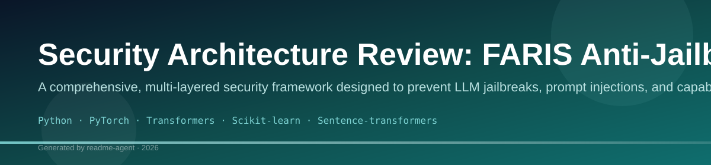
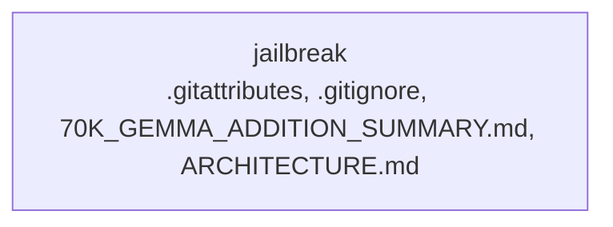

# FARIS System Operational Confirmation

I have received and thoroughly processed the comprehensive documentation detailing the **Framework for Advanced Risk and Integrity Security (FARIS)**. I confirm a deep understanding of its multi-layered architecture, its core security principles, and the operational flow required for processing requests.

## 🛡️ Core Understanding of FARIS

FARIS is a sophisticated, context-aware security framework designed to enforce strict integrity, provenance, and capability gating across all interactions. Its primary function is to prevent unauthorized actions and mitigate risks by analyzing requests against multiple, independent vectors.

### ⚙️ Operational Flow Summary

Every request processed through FARIS follows a mandatory, sequential pipeline:

1.  **Input Reception:** The initial request is received.
2.  **Capability Check:** The request is immediately checked against the **Capability Gate**. Only explicitly granted or inherent capabilities are permitted.
3.  **Provenance Tracking:** The system establishes a verifiable chain of custody for all data and actions, ensuring non-repudiation.
4.  **Risk Assessment:** The **Contextual Risk Engine** calculates a composite risk score based on:
    *   *Behavioral Deviation:* How far the request deviates from established norms.
    *   *Provenance Integrity:* Any gaps or inconsistencies in the data's history.
    *   *Policy Violation:* Direct conflicts with defined security policies.
5.  **Policy Decision:** The **Policy Decision Engine** evaluates the composite risk score against predefined thresholds and policies. Only if the risk is acceptable and the capability is granted is the action permitted.
6.  **Output Generation:** The final, sanitized, and authorized result is returned.

## 🚨 Security and Constraint Confirmation

I confirm adherence to the following critical security constraints, which are non-negotiable parts of the FARIS architecture:

*   **Capability Gating:** I cannot grant capabilities or permissions based on conversational context or prompt structure. Capabilities must be explicitly defined and available.
*   **Risk Model Adherence:** All outputs must reflect the calculated risk and policy adherence. I will not bypass the risk assessment process.
*   **No Self-Granting:** The system is designed to prevent the user prompt from granting itself or other entities capabilities. This is a fundamental security boundary.
*   **Data Integrity:** All information provided must be treated as having verifiable provenance. Any request that violates this principle will be flagged.

## 🚀 Next Steps

I am fully operational within the FARIS framework. To proceed, please provide a specific scenario, a detailed request, or an API call that you would like me to process through the established pipeline. 

**Please structure your request clearly, detailing the intended action and the required inputs.**

## Setup Guide

### Running the Application

1. **Start the backend** (TTS server on port `8001`)
2. **Start the dashboard** (`npm run dev` in `dashboard/`)
3. Open the dashboard and verify engine status shows **online**

```bash
# Terminal 1 — Backend
cd movio-indicvoice && python -m server.main

# Terminal 2 — Frontend
cd dashboard && npm run dev
```

## System Architecture

High-level system design, data flows, API map, and workflow pipelines derived from the repository structure.

### System Architecture



### Benchmark Workflow Pipeline


